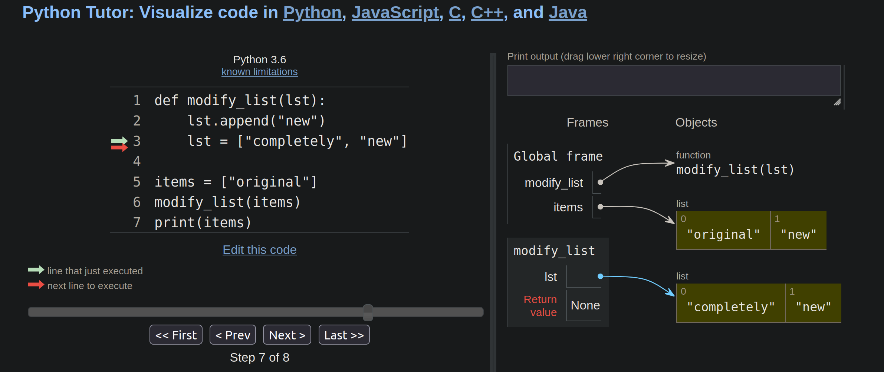
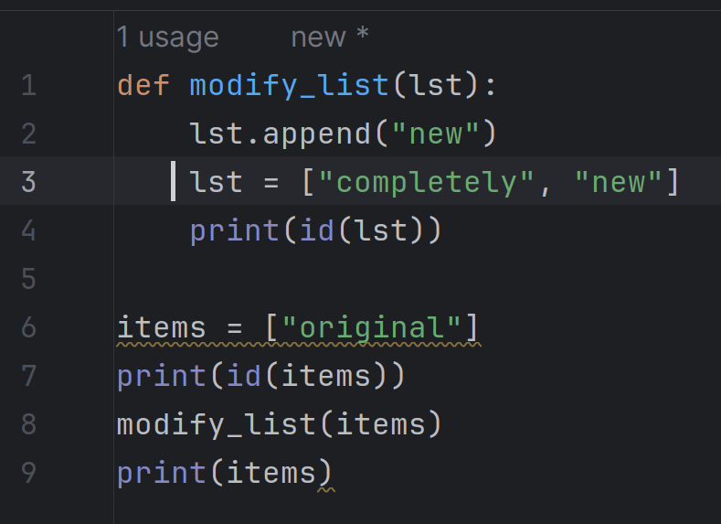
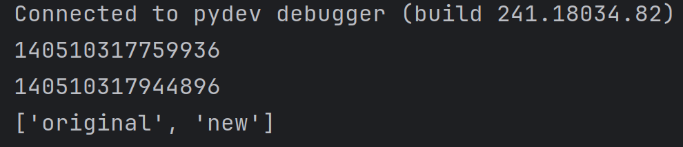

# Lesson Overview
Introduction to intermediate concepts:
- Modular programming
- Pass-by-reference
- (optional) Intro to 2D data structures

## Objectives
1. Understand the mechanics and reasoning for 
modular programming in Python
2. Understand pass-by-reference and its application in Python
3. Apply your knowledge to practical and synthetic problems


# Outcome

- Be able to answer the following questions:

1. What is a module in Python? How do you create one?
- Modules are a file that contains python code. This could have functions classes and variables
- These could be reused by being imported from it
- to create one, make a py file, then add classes and functions
```python
class BigBrain:
    def __init__(self, size, content):
        self.size = size
        self.content = content
        
    def think(self):
        return f"Brain size: {self.size}, massive intellect"
```
2. What is the purpose of the import statement in Python? Can you provide a code example of its usage?
- You can pull functions, classes and variables from a module using import into another file, or other modules.
```python
import Module

collin_brain = Module.BigBrain("massive", "beans")
print(collin_brain.think())
```
3. How can you import only a specific function or class from a module in Python? What is the syntax for this?
- You can use the from keyword, then import the specific function
```python
from Module import handshake

hand = "Right hand"

print(handshake(hand))
```
4. How would you explain Python's parameter-passing mechanism? Is it more similar to pass-by-value or pass-by-reference?
- When you pass a parameter to a function, you pass a reference to the object, but not the object itself.
- This would be more similar to pass by reference

5. Given the following Python code, what will be the output and why?
- It would print a list with "original" and "new"
- 
- 
- 
- 
```python
def modify_list(lst):
    lst.append("new")
    lst = ["completely", "new"]

items = ["original"]
modify_list(items)
print(items)
```
6. If Python uses pass-by-reference, why doesn't reassigning a variable inside a function change the original variable outside the function? How is this related to the mutability of Python objects?
- When you reassign the lst variable inside a function, it changes the local reference to point to a new object.
- that lst variable inside the function points to a different address than the items
- indicates a new object was made


- mutable objects (lists,dictionaries) 
- If you modify the object using the reference inside the function (e.g., by adding an item to a list), the change will be reflected outside the function because both the function parameter and the original variable refer to the same object.
- However, if you reassign the parameter to a new object, you are only changing the local reference inside the function. The original variable outside the function still refers to the original object.


- immutable objects (integers, strings, tuples)
- If you try to modify the object (e.g., by attempting to change an integer), you are essentially creating a new object and reassigning the local reference inside the function. The original variable outside the function remains unchanged.


- Be able to refactor non-modular code into modular alternatives.
